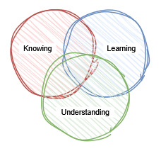
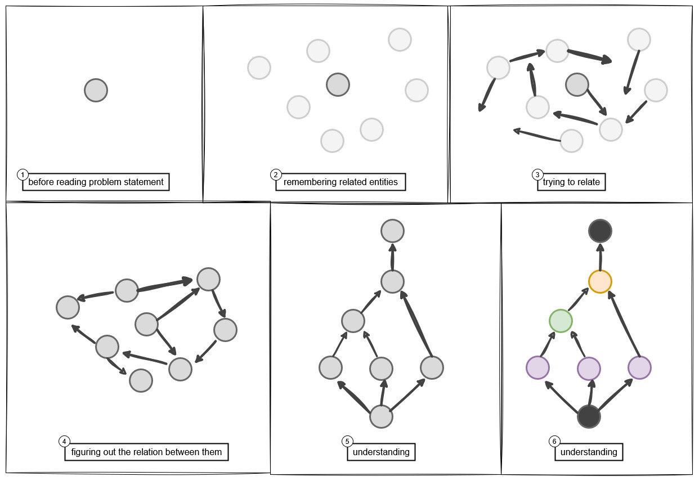

# Theory of Understanding

## Preface

> If you find something hard to understand, _BLAME YOUR OWN LACK OF KNOWLEDGE!_ since you were first born knowing nothing, then you've learned. There’s so much you still don’t know. things that confuse you now, but later, you may see them clearly and understand. — Nahj al-Balagha, (Letters 31-35), by Imam Ali

## Chapter 0; Background

### A Question: What is the measurement for complexity or difficulty of a problem?

the turning point was when in a online class, the teacher classified a question with answer of about 2 pages long as "*very simple*", it got me thinking  that "*what is the real measurement of simplicity?"

### A Problem: Why are Mind-Maps per se useless

I did some Mind Map and it really could not help me to solve end of chapter problems. I've noticed that every problem has unique GoT and relates different ideas, hence there is no sparse GoK (i.e. mind-map) that can help us.

In order to mitigate the above problem, one might suggest adding lots of edges between nodes (cross referencing), but nobody can understand a super dense GoK, by looking at it! Another solution would be to create different versions of GoK based on different aspects e.g. centeric nodes be people, centrric nodes be time periods, etc

That is why tools like GoK of Obisidian software would not help much and they are rather a fancy feature to make people say *WOW!*. I've tried implmenting a GoK app similar to [Kumu](https://kumu.io/) and not only it was time-consuming, it would not help me understant better. sure the remembering got easier but it was mostly becuase of documenting stuff; and I even want to say that, it was *very shallow* kind of remembering.

I've asked DeepSeek AI to give opinion about mind maps if he were *Richard Feyman*. the result is actually impressive (some of them are rather funny):

> "Nature doesn’t organize itself into pretty radial diagrams. If your understanding can’t handle a little chaos, it’s not understanding—it’s interior decorating."

> "Mind maps are like tour buses: you see all the sights, but you never step into the street. Real thinking means getting lost sometimes."

> "Drawing a line between two ideas doesn’t mean you’ve connected them—any more than tying a string between two lampposts means you’ve invented the telegraph."

> "The best mind map is the one you crumple up and throw away—because you don’t need it anymore."

> "Drawing a mind map to understand physics is like painting a sailboat to learn the wind."

> "Knowledge isn’t a dot you can connect—it’s the fire that burns between them."

> "Understanding isn’t a tree. It’s a wildfire—and you’re supposed to be the arsonist."

### A Journey

- [Simple Made Easy]([8 Things I Learned from Rich Hickey That Helped Me Write Better Software (Simple Made Easy)](https://paulrcook.com/blog/simple-made-easy)) by Rich Hickey

## Chapter 1; Venn Diagram of KLU

- **Learning** (L): pattern matching (i.e. making particular neural connection between or in other words, "shortcuts"), ability to do basic pattern matching i.e. repeating tasks in predicted order. unable to reason new situations (problems)

- **Understanding** (U): ability to relate what you know and what you learnt, not useful without K since causes false conclusions.(Misunderstandings due to faulty connections). see [Tesla's quote](https://fixquotes.com/quotes/the-scientists-of-today-think-deeply-instead-of-1057.htm)

- KL: Mastery, i.e. skill

- KU: Synthesis, can solve problems and from new thoughts but requires time

- LU: A person learns patterns (L) intuitively (e.g., native speakers picking up grammar rules without being taught) And develops some level of understanding (U) from those patterns, Even without explicit knowledge (K)

- KLU: Alchemy, highest level of understanding. enabling combining and creation.

> Learning (L) refine Knowledge (K) through practice, Understanding (U)  feed back into improving Learning (L) (e.g., learning strategies  

> A student studying physics might start by memorizing formulas (K), practice solving problems (L), then grasp *why* those formulas work (U). KLU would let them invent a novel experiment or critique flawed theories.

- [ ] explain more, give examples and try to be poetic

## Chapter 2; How we [should] solve a problem

here's the steps that are being taken by almost everyone

0. **Focus**: highlight important parts and figure out *what is wanted*.
1. **Recall**: remember related information 🌟
2. **Relate**: make connection
3. **Reason/Calculate**: conclude or process
4. **Repeat**: repeat the process until you're done.
5. **Doubt**: explore the possibilities of other answers by assuming you're answer is wrong or you've missed something

> Thanks to Eric Demaine for his SRTBOT method for formulating dynamic programming solution. see "introduction to algorithms" in MIT open course ware. 

--------

the step (5) is too abstract, I felt that all of nodes are not the same, they seem different in nature and their purpose. so I categortized them as:

- ⚫ black: **problem** or **sub-problem** or **goal**
- 🟣 purple: **recall**
- 🟢 green: **reason**
- 🟠 orange: **calculate** or **compute
- **Edges** : Show connections (i.e., "*Relates to*" or "*Builds on*")

 

## Chapter 3; extension based on GoT

### Basics

it is recommended to read [Demystifying Chains, Trees, and Graphs of Thoughts](https://arxiv.org/abs/2401.14295) before reading this chapter.

Typical mind-maps are just GoT based on "contents list" of the book. GoK is a lot more dense than you might think. 

GoT (Graph of Thought) is a DAG (Directed Acyclic Graph), that is specific (but no unique) to question. GoK on the other hand is more general and it is intended to be able to answer various questions.

### Straight-forwardness and Explorative connections

If a solution to a problem resembels the direction of edges between nodes similar to what the learner's mind, we say that the solution is *straight-forward*, on the other hand if the direction of edges between nodes for an solution to a does not exist between nodes or does not exists **directly** between the nodes in the learner's mind, then we say that the solution is not *straight-forward* (SF) or it is *Explorative* (Ex).

Thus the term straight-forward is subjective according to the learning material and the learner.

Note that just connecting 2 nodes are not important, the *direction* of the edge also matters. for example a language learner first looks at the word e.g. "camera", then translates it to his mother tongue e.g. Persian ("دوربین") and then translating, he imagines the real camera in his mind. but he may have trouble to do it vice verse i.e. seeing a camera and then finding its English word. it is true that the person probably can find the word *after some time* but it is not **obvious** i.e. it's not present *directly* in his GoK.

In the above case we say that the person "knows" that word, but he must think more and accordingly takes more time for him compared to another learner that the image of every word is associated along with the word in his mind.

***we say that height of the node English "Camera" from Persian "دوربین" is high but not vice versa.***

*Thinking* means *sinking* ideas into the brain, where they grow unseen ...

Simple/Complex GoT

a GoT that has more fusion nodes, is more complex

Fusion nodes

nodes that have in-edges more than 1

Shallow/Deep GoT

Weight of a GoT: Heavy-ness / light-ness

The more the width of the GoT more ideas involved or more options have to be considered, we use the term **heavy** for such GoT.

#### height of a node in GoT

think of GoT as Valley, and nodes as hills and Mountains. The more unconventional to get from a neighbours of a node to it, the more the height of it.

#### hint

hints are trying to lower the height of the next node. it is the ability of teacher to try to make everything obvious (height of 0) for his students

## Show case

### Demo

I've developed an app to kinda see my theory in aciton.

- [konkur comp](https://hamidb80.github.io/konkur-comp/)

https://github.com/user-attachments/assets/ca412b50-5000-4be1-b805-8aaaafab3eb7

### Manual

TODO

## Appendix [FIXME spread it somewhere else]

#### opinion on people's behaviour on social media

most people in social media want quick and easy conclusions, i.e. shallow and straight-forward directions. which most of the times appears to be incorrect and destructive. this behaviour is exactly opposite of what Quran want from us: `افلا تعقلون` i.e. `why don't you think [more]?`

#### idea about creativity

> here what I mean by the word "create" is that makeing/producing something that the creator/author has not seen like it before.

to create something new, the person need to connect sometimes even unrelated nodes in his GoK in a way that makes sense. the feature of connecting no so obvious unrelated nodes in brain requires some level of forgetting since he or she must not consider all of the details about it and sometimes has to misremember or misinterpret the details about it. I didn't know that forgetting can be blessing.

I've read somewhere that creative people tend to forgot more, as their brain gets good at losing connection between nodes in KoG and even creating false connections between them.

by the definition, you might've guessed that creative work is not straight-forward.

Reference:

- [A Surprising Link Between Creativity and False Memories](https://www.psychologytoday.com/us/blog/ulterior-motives/202110/surprising-link-between-creativity-and-false-memories)

## Inspirations

- [The art of note-"making" 📃](https://mischavandenburg.substack.com/p/the-art-of-note-making). 

- [Neurite 🌐](https://github.com/satellitecomponent/Neurite)

- [Brilliant 🌐](https://brilliant.org/) | Learning by doing

- [makandra cards 🌐](https://makandracards.com/)

- [Networks of the Brain 📚 by Olaf Sporns](https://direct.mit.edu/books/monograph/2149/Networks-of-the-Brain)

- [Proof Wiki 🌐](https://proofwiki.org/?ref=cybrhome)

- [Interactive Theorem Proving: Isabelle/HOL](https://www.youtube.com/watch?v=AhybiY0JHvg)

- [What Good Is Learning If You Don’t Remember It? 📃](https://files.eric.ed.gov/fulltext/EJ1055665.pdf)

- [how to solve it by G. Polya 📚](https://www.amazon.com/How-Solve-Mathematical-Princeton-Science/dp/069111966X)

- theory of syntax: chomsky

- [7 FAST Chinese and Japanese SECRETS for students to EASILY become TOPPERS](https://youtube.com/watch?v=BszXLBKWscA&listen=false)

- https://www.youtube.com/watch?v=iW7Fp9Mtq1Y&t=32

- [*Constructinism* and *Connectionism* Learning theories](https://www.youtube.com/watch?v=SH15sqpqy_Q)

- https://www.youtube.com/watch?v=EY6bVsHPh0Y

- [Becoming good at math is easy, actually](https://www.youtube.com/watch?v=brvugRQVDLM&t=166) 

## Notes for myself

- chain of thought: رشته افکار
